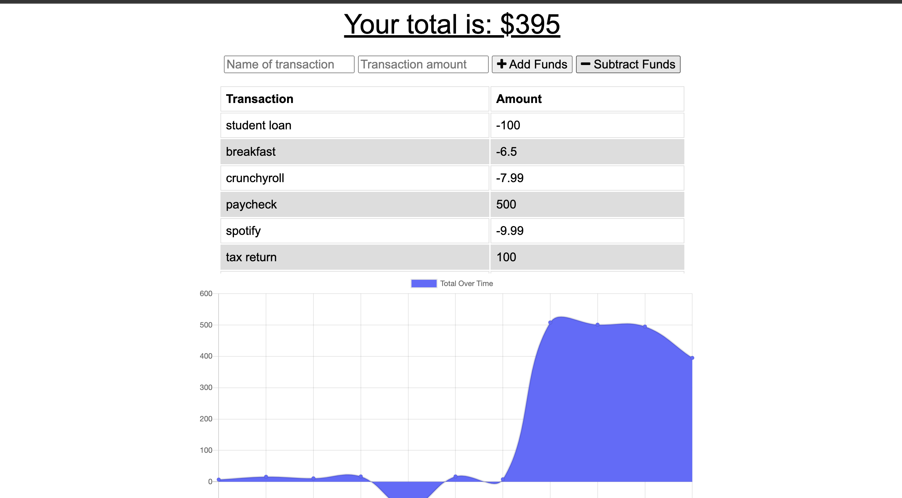

<h1 align="center"> 💳 Budget Tracker 💳</h1>

 
## Description
This is a web application for those who need to be able to track their daily expenses.

## Table of Contents
- [Description](#description)
- [Installation](#installation)
- [Usage](#usage)
- [License](#license)
- [Contributing](#contributing)
- [Tests](#tests)
- [Questions](#questions)
## Installation
Just run the application by going to https://budget-track-22.herokuapp.com/
## Usage
For those who want to track their day to day spending habits
## License

 
This application is covered by the MIT license. 
## Contributing
Taylor Hernandez
## Tests
Not right now.
## Questions
Just email hernandeztaylor1@gmail.com 
 
:octocat: Find me on GitHub: [TayHern](https://github.com/TayHern) 
 
Email me with any questions: hernandeztaylor1@gmail.com  
  
